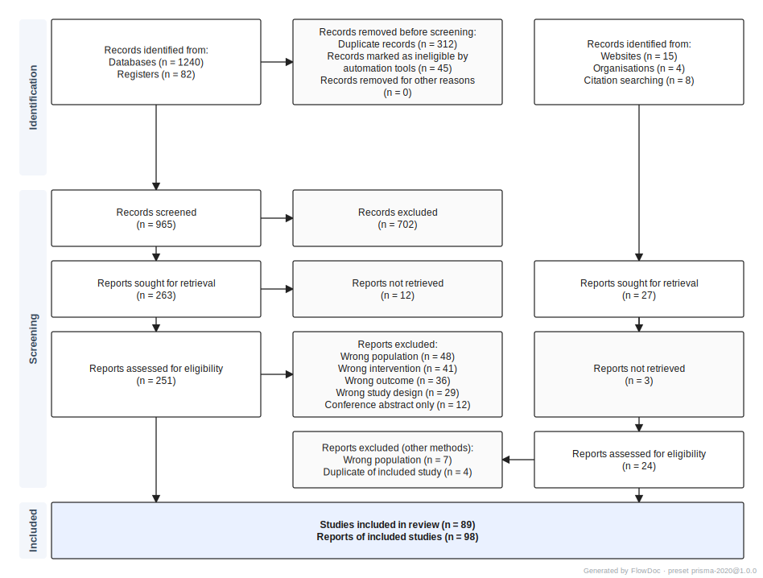
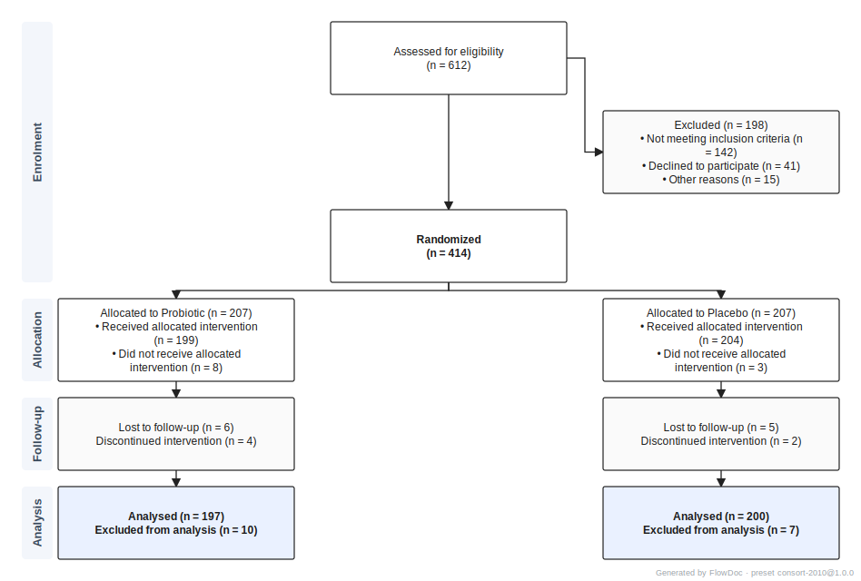
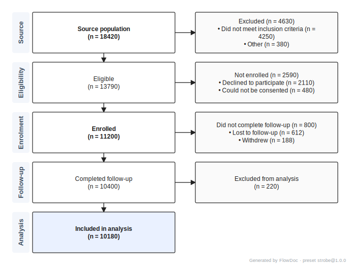

<!-- Project & licence -->
[](LICENSE)
[](https://github.com/htlin222/flowdoc/releases)
[](#status)
[](#)
[](https://github.com/htlin222/flowdoc/pulls)

<!-- Tech stack -->
[](https://www.typescriptlang.org)
[](https://nodejs.org)
[](#install)
[](package.json)
[](tsconfig.json)

<!-- Quality / engineering -->
[](test/)
[](#determinism)
[](test/)
[](src/)
[](#tests)

<!-- Reporting guidelines covered -->
[](https://www.bmj.com/content/372/bmj.n71)
[](https://www.bmj.com/content/340/bmj.c332)
[](https://www.thelancet.com/journals/lancet/article/PIIS0140-6736(07)61602-X/fulltext)
[](#status)

<!-- Output formats -->
[](examples/prisma-review.svg)
[](examples/prisma-review.pdf)
[](examples/prisma-review.png)
[](examples/prisma-review.drawio)
[](examples/prisma-review.mmd)

<!-- Input formats -->
[](examples/prisma-review.yaml)
[](examples/prisma-review.json)
[](examples/prisma-review.csv)

<!-- Citation / scholarship -->
[](https://zenodo.org)
[](https://orcid.org/0009-0002-3974-4528)
[](CITATION.cff)
[](citation.bib)
[](csl/)

<!-- GitHub activity -->
[](https://github.com/htlin222/flowdoc/stargazers)
[](https://github.com/htlin222/flowdoc/network/members)
[](https://github.com/htlin222/flowdoc/issues)
[](https://github.com/htlin222/flowdoc/commits/main)
[](#)
[](#)

<!-- Vibes -->
[](#why-this-exists)
[](#determinism)
[](#)
[](#)

# FlowDoc

> Deterministic, preset-driven flow diagrams for reporting guidelines (PRISMA 2020, CONSORT 2010, STROBE; MOOSE / ARRIVE planned).

A small TypeScript package that generates publication-quality flow diagrams from a structured data file. Source-of-truth is **YAML / JSON / CSV** — your choice — and outputs are **SVG / drawio / Mermaid / PDF / PNG**, all produced from the same in-memory layout with zero external runtime dependencies.

Built as a 2026-stack alternative to the R/Shiny [`PRISMA2020`](https://github.com/prisma-flowdiagram/PRISMA2020) package: no R runtime, no `.shinyapps.io` cold-starts, no Graphviz dependency, byte-deterministic output suitable for `git diff` and CI.

## Why this exists

The official PRISMA 2020 R package is excellent science but inconvenient infrastructure: it requires R, depends on Graphviz/DiagrammeR for layout, and produces output that's hard to embed outside R Markdown. For a reporting-guideline diagram — which is essentially **a fixed-shape DAG with a handful of count fields** — that's overkill.

FlowDoc separates three concerns:

1. **Data layer** — a flat key/value document (YAML/JSON/CSV) you author by hand or generate from your reference manager
2. **Engine layer** — preset-agnostic, deterministic grid layout + Manhattan edge routing
3. **Render layer** — SVG primary, drawio for further hand-editing, Mermaid for GitHub/Notion embeds

Adding a new guideline (CONSORT, STROBE, …) means writing one preset file. The engine doesn't change.

## Gallery

| PRISMA 2020 | CONSORT 2010 | STROBE |
| :---: | :---: | :---: |
| [](examples/prisma-review.svg) | [](examples/consort-trial.svg) | [](examples/strobe-cohort.svg) |
| Systematic review | Parallel-group RCT | Cohort participant flow |
| `examples/prisma-review.yaml` | `examples/consort-trial.yaml` | `examples/strobe-cohort.yaml` |

Each cell renders the same `LaidOutDiagram` to all five output formats — pick the one you need: `.svg` / `.pdf` / `.png` / `.drawio` / `.mmd`.

## Install

```bash
npm install
npm run build
```

This produces `dist/` and a runnable CLI at `bin/flowdoc.mjs`.

## Quick start

```bash
# Create a blank PRISMA 2020 template
node bin/flowdoc.mjs init --preset prisma-2020 -o review.yaml

# Validate it (checks types + flow accounting invariants)
node bin/flowdoc.mjs validate review.yaml

# Render to SVG
node bin/flowdoc.mjs render review.yaml -o fig1.svg

# Export to other formats
node bin/flowdoc.mjs export review.yaml --format drawio  -o fig1.drawio
node bin/flowdoc.mjs export review.yaml --format mermaid -o fig1.mmd

# Convert between IO formats (auto-detected by extension)
node bin/flowdoc.mjs convert review.yaml -o review.csv
node bin/flowdoc.mjs convert review.csv  -o review.json
```

A complete worked example is in `examples/prisma-review.yaml` together with the rendered `prisma-review.svg`, `prisma-review.drawio`, and `prisma-review.mmd`.

## CLI reference

```
flowdoc init     [--preset ID] [--format yaml|json|csv] [-o FILE]
flowdoc validate <FILE>
flowdoc render   <FILE> -o <OUT.svg> [--no-watermark] [--no-metadata] [--generated-at ISO]
flowdoc export   <FILE> --format svg|drawio|mermaid|pdf|png -o <OUT> [--generated-at ISO]
flowdoc convert  <IN>   -o <OUT>          # format detected from extensions
flowdoc presets  [list | show ID]
flowdoc --version
```

## IO formats

All three formats roundtrip losslessly through the same in-memory `FlowDocument`. CSV→YAML→SVG is byte-identical to YAML→SVG (verified in `test/cli.test.mjs`).

### YAML (recommended source-of-truth)

```yaml
$schema: https://flowdoc.dev/schema/v1
preset: prisma-2020
metadata:
  title: "A systematic review of X on Y"
  authors: [Lin W, Chen Y]
  doi: "10.xxxx/xxxx"
data:
  db_records: 1240
  registry_records: 82
  duplicates_removed: 312
  records_screened: 965
  records_excluded: 702
  reports_sought: 263
  reports_assessed: 251
  exclusion_reasons:
    - { reason: "Wrong population", n: 48 }
    - { reason: "Wrong outcome",    n: 36 }
  studies_included: 89
  reports_of_included_studies: 98
  # ... see examples/prisma-review.yaml for the full field list
```

### JSON

Same shape as YAML, 1:1 mapping. Useful for programmatic pipelines.

### CSV (spreadsheet-friendly)

```csv
field,value
$preset,prisma-2020
$title,"A systematic review of X on Y"
$authors,"Lin W;Chen Y"
$doi,10.xxxx/xxxx
db_records,1240
registry_records,82
exclusion_reasons,"Wrong population:48;Wrong outcome:36"
studies_included,89
```

`$`-prefixed fields are metadata (`$preset`, `$title`, `$authors`, `$doi`, `$date`, `$language`, `$notes`). Any field starting with `exclusion_reasons` is parsed as a `reason:n;reason:n;…` list. Other fields are scalars.

## Library API

```ts
import {
  parseYaml, validate, layout, renderSvg, exportDiagram, getPreset,
} from "flowdoc";

const doc = parseYaml(yamlSource);
const preset = getPreset(doc.preset);
const result = validate(doc, preset);
if (!result.valid) throw new Error(result.issues[0].message);

const diagram = layout(doc, preset);
const svg = renderSvg(diagram, { generatedAt: "2026-04-25T00:00:00Z" });
const drawio = exportDiagram(diagram, "drawio");
const mermaid = exportDiagram(diagram, "mermaid");
```

## Validation & flow accounting

`validate(doc, preset)` runs two passes:

1. **Schema** — checks each field's type (`number` / `string` / `exclusion_reasons`) against the preset's `fields` declarations. Required fields missing → error. Unknown fields → warning.
2. **Flow accounting** — each preset declares invariants like `records_screened = db_records + registry_records − duplicates_removed − automation_excluded − other_prescreen_removed`. Imbalances are reported as warnings (not errors) because real-world systematic reviews sometimes have unexplained discrepancies.

PRISMA 2020 invariants currently checked: `SCREEN_IN`, `SCREEN_OUT`, `SOUGHT_OUT`, `OTHER_SOUGHT_OUT`, `INCLUDED_BALANCE`.

## Determinism

Same `FlowDocument` + same preset → byte-identical SVG (when `--generated-at` is fixed). Useful for:

- `git diff` on rendered figures
- CI visual-regression testing
- reproducible supplementary materials

The engine never calls Graphviz or any layout algorithm with non-deterministic ordering. Coordinates come from a fixed grid + per-row dynamic height computed from text wrapping, both pure functions.

## DOI & academic citation

Three layers:

1. **Software DOI** — register the repository with [Zenodo](https://zenodo.org). On every GitHub release, Zenodo mints a new DOI. `CITATION.cff` and `.zenodo.json` in this repo support that workflow.
2. **Preset citation** — each preset embeds the appropriate guideline citation. PRISMA 2020 cites Page MJ et al., BMJ 2021;372:n71 (DOI: 10.1136/bmj.n71). View with `flowdoc presets show prisma-2020`.
3. **Per-figure metadata** — each rendered SVG embeds RDF metadata (`<dc:title>`, `<dc:identifier>` with DOI, `<dc:creator>`, preset id+version, generation timestamp). PDF exporters that preserve SVG metadata carry this through.

Suggested Methods sentence:

> Flow diagrams were generated with FlowDoc v0.1.1 (DOI: 10.5281/zenodo.XXXXX) following the PRISMA 2020 statement (Page et al., 2021, DOI: 10.1136/bmj.n71).

## Adding a new preset

1. Create `src/presets/<id>/index.ts` exporting a `Preset` object with `fields`, `nodes`, `edges`, `sections`, `grid`, and `invariants`.
2. Register it in `src/presets/index.ts`.
3. Add tests under `test/`.

The PRISMA 2020 preset (`src/presets/prisma-2020/index.ts`, ~200 lines) is the reference implementation.

## Tests

```bash
npm test    # 80 tests across IO, validation, layout, exporters, template, CLI, matrix
```

Coverage includes: YAML/JSON/CSV roundtrips, CSV escaping, type validation, flow-accounting invariants, layout determinism, no-overlap, SVG metadata embedding, drawio XML well-formedness, Mermaid output, and end-to-end CLI smoke tests.

## Citation

If you use FlowDoc in your work, please cite it:

```bibtex
@software{lin2026flowdoc,
  author  = {Lin, Hsieh-Ting},
  title   = {{FlowDoc}: Deterministic flow diagrams for reporting guidelines},
  year    = {2026},
  url     = {https://github.com/htlin222/flowdoc},
  version = {0.1.1},
  license = {MIT}
}
```

<details>
<summary>AMA format</summary>

Lin H-T. *FlowDoc: Deterministic flow diagrams for reporting guidelines*. Version 0.1.1. Published online 2026. https://github.com/htlin222/flowdoc

</details>

<details>
<summary>APA format</summary>

Lin, H.-T. (2026). *FlowDoc: Deterministic flow diagrams for reporting guidelines* (Version 0.1.1) [Computer software]. https://github.com/htlin222/flowdoc

</details>

`csl/american-medical-association.csl` and `csl/apa.csl` are bundled for use with Quarto / Pandoc citation processors.

## License

MIT — see [LICENSE](LICENSE). Copyright (c) 2026 Hsieh-Ting Lin.

## Export formats

| Format  | Type   | Determinism                              | Notes                                            |
| ------- | ------ | ---------------------------------------- | ------------------------------------------------ |
| SVG     | text   | byte-identical with `--generated-at`     | primary, embeds RDF metadata                      |
| drawio  | text   | byte-identical apart from creation date  | uncompressed mxGraphModel, hand-editable          |
| Mermaid | text   | byte-identical                           | GitHub / Notion native rendering                  |
| PDF     | binary | byte-identical with `--generated-at`     | PDF 1.4 single page, Helvetica Base14, no embed   |
| PNG     | binary | byte-identical                           | RGB raster, 5×7 ASCII bitmap font, zero deps      |

PDF/PNG are produced from the same `LaidOutDiagram` as the SVG renderer — they are not external SVG-conversion stages. The PNG exporter ships a small ASCII bitmap font in-source; CJK glyphs fall back to a placeholder square. PDF labels go through a Unicode → WinAnsi remap so common punctuation (•, –, —, smart quotes, ellipsis) survives the round-trip.

## Presets

| id            | guideline                                  | citation DOI                       |
| ------------- | ------------------------------------------ | ---------------------------------- |
| `prisma-2020` | PRISMA 2020 (systematic reviews)           | 10.1136/bmj.n71                    |
| `consort-2010`| CONSORT 2010 (parallel-group RCT)          | 10.1136/bmj.c332                   |
| `strobe`      | STROBE (cohort participant flow, item 13)  | 10.1016/S0140-6736(07)61602-X      |

`flowdoc presets show <id>` prints the full preset including invariants and citation.

## Status

v0.1.0 — three presets (PRISMA 2020, CONSORT 2010, STROBE), three IO formats (YAML / JSON / CSV), five exporters (SVG, drawio, Mermaid, PDF, PNG), 80-test suite covering the full preset × format matrix. Roadmap: MOOSE, ARRIVE; Quarto extension; static web UI.
